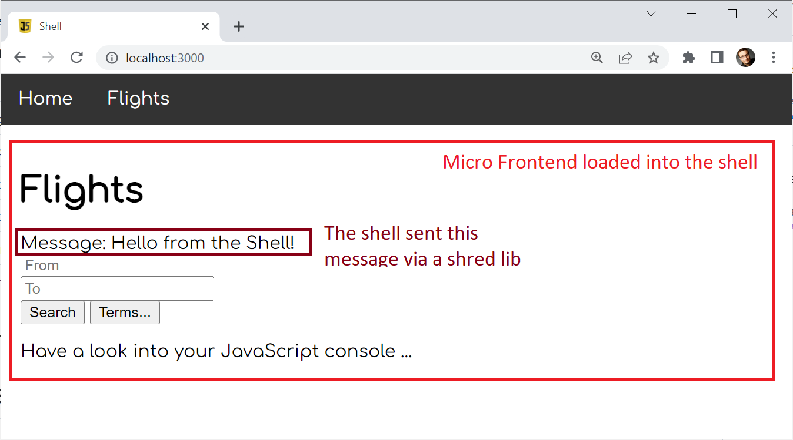

# Native Federation Core Example



This example demonstrate how to use Native Federation in a framework- and tooling-agnostic way. For this, Native Federation Core -- ``@softarc/native-federation`` -- is used.

> Hint: There is also an [Angular-based wrapper](https://www.npmjs.com/package/@angular-architects/native-federation).

## Try it out

```
npm i
npm run build
npm start
```

> This simple example does not implement a watch-mode for development.

## Inspect the Example

- Have a look at the project structure: It contains a shell (host), a micro frontend mfe1 (remote), and a shared lib used for exchanging data between the shell and the shell and mfe1.

- Have a look at the build process in the file [build/build-common.ts](build\build-common.ts). It's a simple ``esbuild``-based process augmented by Native Federation.

- The build process uses an [adapter](build\esbuild-adapter.ts) to bring in the build tool of your choice.

- Have a look at the file [federation.config.js](shell\federation.config.js) in the shell. It configures Native Federation. The ``shareAll``-helper shares all the libs found in your ``package.json`` in the node ``dependencies``.

- The Micro Frontend's [federation.config.js](mfe1\federation.config.js) also exposes a component. This component can be loaded into the shell.

- The entry point into the shell is the file [main.ts](shell\main.ts). It initializes ``Native Federation`` and passes key data about the remotes. Then, it loads the application via an dynamic ``import``.

- The entry point into mfe2 is called [main.ts](mfe1\main.ts) too. It's similar to the one used by the shell. However, it doesn't point to further Micro Frontends.

- The shell's [app.ts](shell\app.ts) uses the function ``loadRemoteModule`` to load the separately compiled and deployed Micro Frontend at runtime.

- Both applications use ``rxjs``. However, it's only loaded once because of using ``shareAll`` in the federation config. To assure yourself of this, just have a look to your browser's network tab.

- For the same reason, the shared-lib (``libs/shared-lib``) is only loaded once and can be used as a mediator for exchaning data between the ``shell`` and ``mfe1``. 
